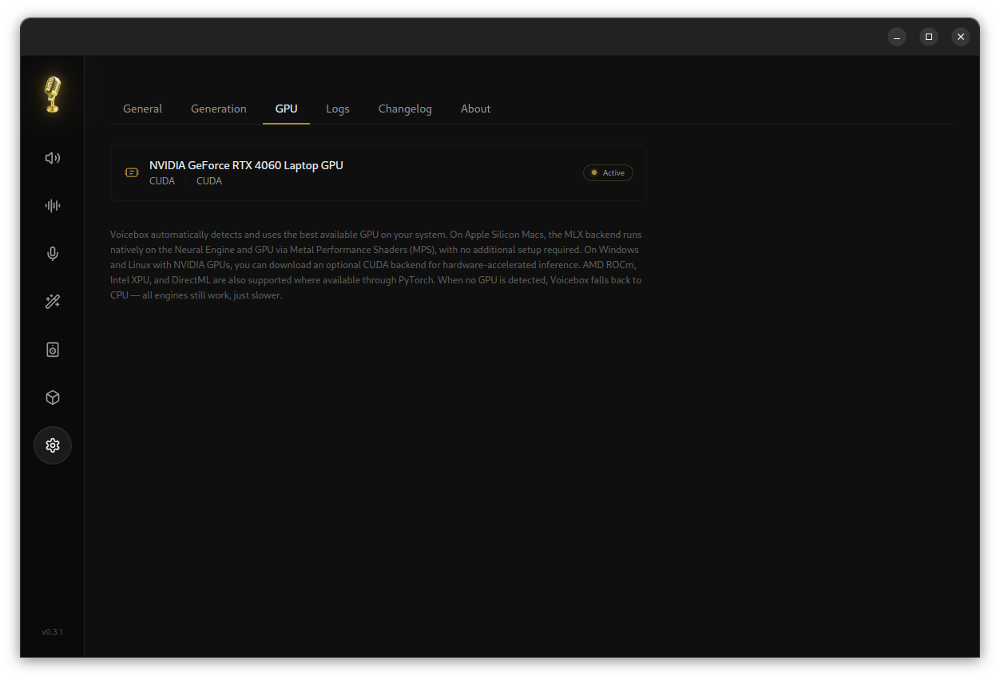
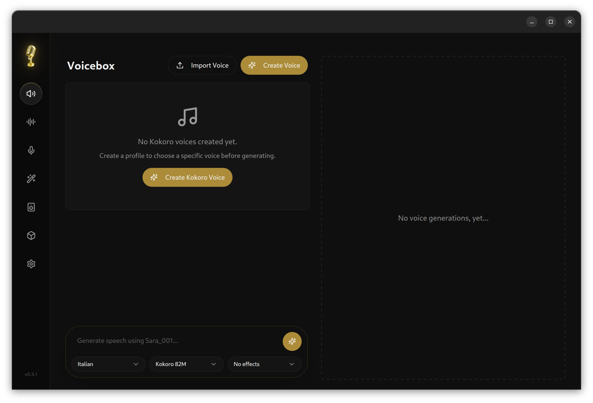
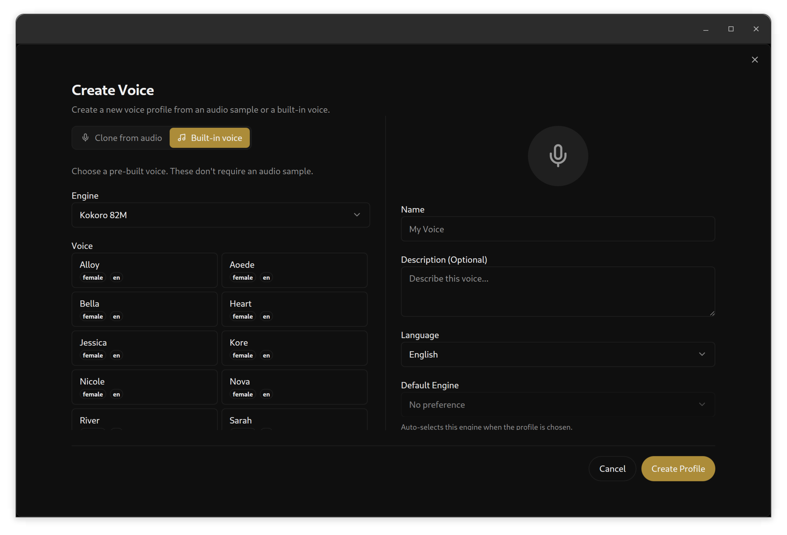
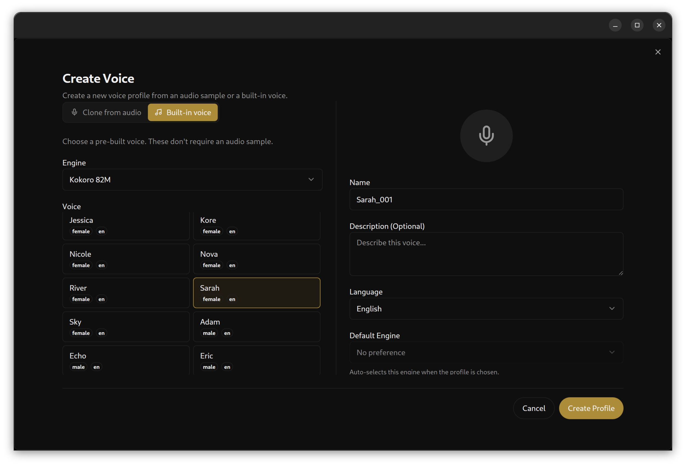

Yarp device for voice synthesis with VoiceBox APIs
=====================

This repository contains the YARP plugin for voice synthesis with `VoiceBox` APIs.

:construction: This repository is currently work in progress. :construction:
:construction: The software contained is this repository is currently under testing. :construction: APIs may change without any warning. :construction: This code should be not used before its first official release :construction:

Documentation
-------------

Documentation of the individual devices is provided in the official Yarp documentation page:
[](https://yarp.it/latest/group__dev__impl.html)


Dependencies
-------------
### VoiceBox

You need to download and install [VoiceBox](https://github.com/jamiepine/voicebox) on your pc (check the repo documentation on how to install the package)
`**Hint:**` Try and launch the voicebox app and see if your GPU is listed in the GPU tab of the options section


If not, check if the torch version in the python virtual env, created by VoiceBox, is compatible with your CUDA version by typing:
``` bash
> python3 -c "import torch; print(torch.cuda.is_available(), torch.version.cuda)"
```
If you get an error, uninstall torch in the virtual env and reinstall a version compatible with your CUDA version. This should allow you tu use VoiceBox with your GPU

Installation
-------------

### Build with pure CMake commands

~~~
# Configure, compile and install
cmake -S. -Bbuild -DCMAKE_INSTALL_PREFIX=<install_prefix>
cmake --build build
cmake --build build --target install
~~~

Usage
-------------

### VoiceBox profile
To be able to actually use the device you need to create at least one voice profile in `VoiceBox`.

To do it follow these steps:

**1. Open the VoiceBox app**


**2. Go to Create Voice**


(For this example we will use a built-in voice)

**3. Select the voice, fill the little form on the right and click Create Profile**


### VoiceBox server
To launch the `VoiceBox` server you have to either launch the app or to manually lanuch the server by going in the `VoiceBox` repo folder and type:
```bash
source backend/venv/bin/activate
bun run dev:server
```

### Yarprobotinterface config file
The recommended way to lanch the device is via `yarprobotinterface`

The following lines contains a simple configuration file to launch the device with the voice profile created previously

``` XML
<!-- SPDX-FileCopyrightText: 2023 Istituto Italiano di Tecnologia (IIT) -->
<!-- SPDX-License-Identifier: BSD-3-Clause -->

<?xml version="1.0" encoding="UTF-8"?>
<!DOCTYPE robot PUBLIC "-//YARP//DTD yarprobotinterface 3.0//EN" "http://www.yarp.it/DTD/yarprobotinterfaceV3.0.dtd">
<robot name="voiceBoxSynthesizer" build="2" portprefix="/ttsBot" xmlns:xi="http://www.w3.org/2001/XInclude">
    <devices>
        <device name="voiceBoxSpeechSynthesis" type="voiceBoxSynthesizer">
            <param name="voice" extern-name="voiceBox_voice">
                Sarah_001
            </param>
        </device>
        <device name="synthesizerWrap" type="speechSynthesizer_nws_yarp">
            <action phase="startup" level="5" type="attach">
                <paramlist name="networks">
                    <elem name="subdeviceVoiceBox">
                        voiceBoxSpeechSynthesis
                    </elem>
                </paramlist>
            </action>
            <action phase="shutdown" level="5" type="detach" />
        </device>
    </devices>
</robot>

```

CI Status
---------

:construction: This repository is currently work in progress. :construction:

[](https://github.com/robotology/yarp-device-template/actions?query=workflow%3A%22CI+Workflow%22)

License
---------

:construction: This repository is currently work in progress. :construction:

Maintainers
--------------
This repository is maintained by:

| | |
|:---:|:---:|
| [](https://github.com/elandini84) | [@elandini84](https://github.com/elandini84) |
